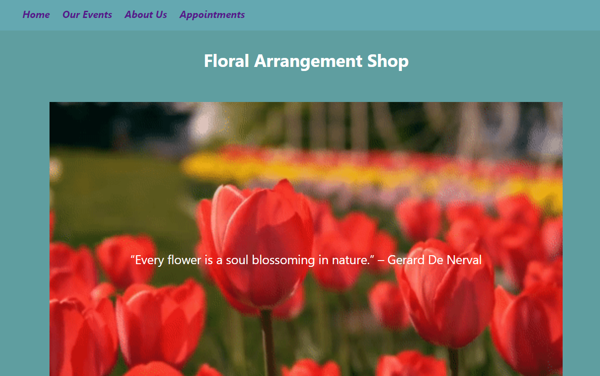
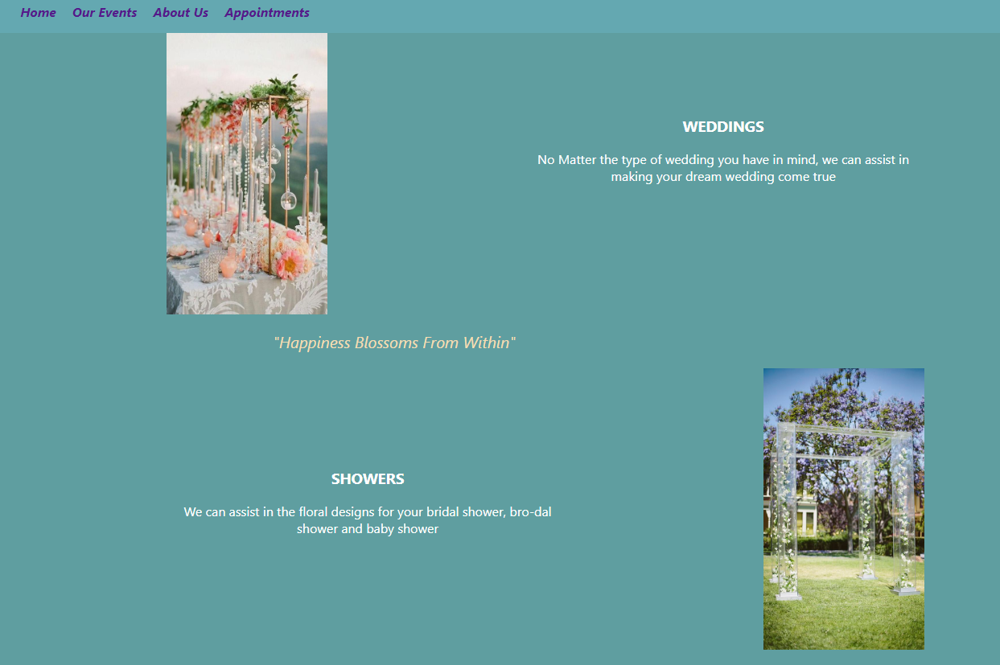
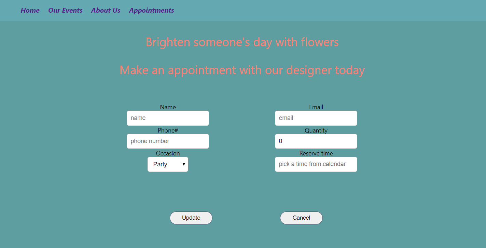
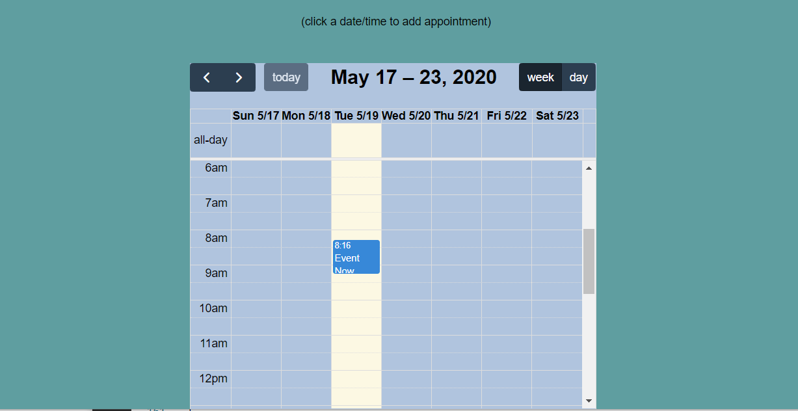

# floral-shop-app

# Wireframe
### Home

### Event

### About Us

### Appointment

### Calendar

# 
# Technologies used
###   fullcalendar and plugins
###   axios
###   react router
# Install commands
###   npm install --save @fullcalendar/react @fullcalendar/core @fullcalendar/daygrid @fullcalendar/timegrid @fullcalendar/interaction
###   npm install --save axios 
# 
# API used
###   Purpose: email validation 
###   API End point: http://apilayer.net/api/check
# 
# User engagement elements
### Nav Bar 
### Appointment form
### Appointment - CRUD using calendar component.
### Gifs:
###   Breezes in Tulip field (in App.js)
# 